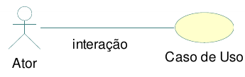
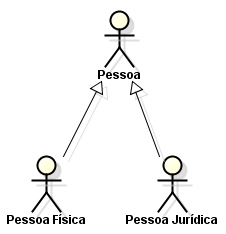

# Livraria da Ana

**IMPORTANTE**: [**Cadastre seu projeto nesse link**](https://docs.google.com/spreadsheets/d/1KXuMJ9TK7GPyahR_BfLwfn4ec7vX7DgiHx42vFc4E7g/edit?usp=sharing).

Professor: [Marco André Mendes](github.com/marcoandre)

Equipe:
- [Ana Heloiza](github.com/ana162)

Links do projeto:
(*Coloque aqui os links para a documentação do projeto e os repositórios e plubicação do backend e frontend.*)
-   [Documentação (esse documento)](github.com/marcoandre/pi-modelo)
-   Backend: [Repositório](github.com/marcoandre/pi-backend) e [Publicação](https://pi-backend.herokuapp.com/)
-   Frontend: [Repositório](github.com/marcoandre/pi-frontend) e [Publicação](https://pi-frontend.herokuapp.com/)

# 1. Desenvolvimento
terão quatro tipos de livros romance,suspense,ação e comédia 
**Gerenciamento de vendas para uma livraria**

# 2. Situação Problema
  cadastro,endereço,site,aba de pesquisa, carrinho, pagamento 

o cliente escolhe o produto,coloca no carrinho,paga e leva o produto

Seguindo essas dicas, você deve ser capaz de descrever o dia-a-dia da empresa selecionada. E para ajudar na organização do texto, indicamos uma abordagem em 3 etapas:

-   **Introdução**:  (livraria da ana, vendas de livros, das 08h  as 18h, o dono, funcionários, etc);
-   **Situação-problema**: a livraria tera  varios tipos de livros,tera um sistema informatizado para facilitar as compras dos livros
-   **Conclusão**:A falta de um sistema de gestão adequado na livraria resultou em dificuldades como: Gestão de Estoque: Perda de controle sobre os livros em estoque, dificuldade em identificar os mais vendidos, e atrasos na reabastecimento, levando a falta de produtos e insatisfação dos clientes.Controle de Vendas: Dificuldade em analisar as vendas por livro, por categoria ou por período, impedindo a identificação de tendências e a tomada de decisões estratégicas para aumentar a rentabilidade.

# 3. Descrição da proposta
A solução proposta é um software de gestão que visa automatizar e simplificar processos, como a gestão de recursos, o controle de estoque e a comunicação interna.O foco é facilitar o trabalho dos funcionários, otimizar o tempo e melhorar a eficiência geral da empresa, especialmente nas áreas de maior dificuldade identificadas.
**Alguns pontos importantes a se destacar são:**

-   **Qual o foco de ação do software** O foco de ação de um software, relacionado aos problemas levantados na análise da situação-problema, define o que o software vai efetivamente fazer para resolver ou mitigar esses problemas. É a funcionalidade central, a razão de ser do software, como no exemplo do Gmail, que permite o envio e recebimento de e-mails.
-   **Os níveis de usuário do sistema**.Em uma livraria, os níveis de usuário do sistema podem variar dependendo das funções de cada funcionário. O gestor (ou administrador) geralmente tem acesso total, enquanto funcionários com               diferentes cargos podem ter acesso restrito a funcionalidades específicas, como consulta de produtos, gestão de estoque, ou atendimento ao cliente.
-   **O que poderá ser feito no software**.No software principal de uma livraria, poderíamos ter funcionalidades para gerir o catálogo de livros, realizar vendas e gerir os clientes.
-   **Se houver mais de um nível de usuário**,Se uma livraria tiver diferentes níveis de usuário (ex: clientes regulares, membros, parceiros), a descrição da proposta deve ressaltar as diferenças entre eles, especificando os benefícios e     privilégios de cada nível.  É crucial destacar como cada nível contribui para a comunidade e como a livraria se beneficia da presença de cada tipo de usuário.
-   
Tenha em mente que essa é uma etapa relativamente breve. Não é necessário um texto gigantesco, apenas dar uma noção do funcionamento do sistema. Mais adiante
precisaremos ser bem detalhistas, todavia agora a intenção é apenas fazer algo que permita ao cliente nos dizer se estamos no caminho certo.

# 4. Modelagem de Dados
A modelagem de dados para uma livraria, em termos de entidades e relacionamentos, envolve identificar elementos como livros, autores, categorias, clientes, pedidos, e formas de pagamento, além de seus atributos e como se relacionam.

# 4. Regras de negócio
A regra pode definir o mínimo de estoque de cada livro, garantindo que a loja não fique sem produtos populares.
Outra regra pode especificar o tempo máximo para um livro ficar em estoque antes de ser considerado para baixa ou promoção.
A regra pode detalhar como os livros devem ser armazenados e organizados para facilitar a identificação e o acesso.

**4.1 O que são regras de negócio?**

Gestão de estoque:
como a livraria calcula o estoque, quando os livros são reabastecidos, e como são identificados os livros de baixa rotatividade.
Processo de vendas:
como os livros são vendidos, se há descontos, como são processadas as devoluções.
Atendimento ao cliente:
como a livraria lida com reclamações e sugestões, como são geridos os dados dos clientes.
Parcerias e fornecedores:
como a livraria escolhe seus fornecedores, como são negociadas as condições de pagamento e frete.
**4.2 Regras para a criação de regras de negócio**
Definindo Regras de Negócio para uma Livraria:
1. Identifique as áreas de negócio:
Comece identificando as áreas principais de operação da livraria, como vendas, estoque, atendimento ao cliente, etc. 
2. Defina as regras para cada área:
Para cada área, estabeleça as regras que devem ser seguidas para garantir a eficiência e conformidade com os objetivos da livraria. 
3. Documente as regras:
As regras devem ser documentadas de forma clara e concisa, usando uma linguagem acessível para todos os envolvidos. 
De maneira geral, as regras de negócio devem:

**4.3 Por que ter regras de negócio?**

- **Padronização de processos:** As regras de negócio padronizam as atividades da livraria, como o processo de venda, estoque, cadastro de produtos, entre outros. Isso garante que todos os funcionários sigam o mesmo padrão, otimizando o     tempo e os recursos, e reduzindo erros e falhas. 
- **Controle de processos:** As regras de negócio facilitam o controle dos processos, pois permitem identificar e corrigir rapidamente qualquer desvio do padrão estabelecido. Por exemplo, se um cliente efetua uma compra online com um desconto não autorizado, a regra de negócio pode identificar e alertar a equipe para correção imediata. 
- **Tomada de decisão:**: As regras de negócio auxiliam na tomada de decisões estratégicas, como definir os critérios de desconto, promoções, condições de pagamento, entre outros. Isso garante que as decisões sejam baseadas em dados e critérios objetivos, e que a livraria cumpra suas metas de vendas e lucratividade. 
**4.4 Exemplos de regras de negócio**

Regras de negócio são diretrizes que determinam como uma livraria opera, afetando processos como venda, estoque, atendimento ao cliente e promoções. Exemplos incluem políticas de devolução, critérios de desconto, horários de funcionamento e procedimentos de venda online. 
Exemplos de Regras de Negócio para uma Livraria:
Venda e Atendimento:
Política de Devolução:
Livros podem ser devolvidos dentro de 7 dias após a compra, se estiverem em perfeito estado e com a embalagem original.
Descontos:
Produtos em promoção podem ter descontos de até 20% em relação ao preço original.
Horário de Funcionamento:
A livraria funciona de segunda a sábado, das 9h às 18h, e domingos das 10h às 14h.
Pagamentos:
Aceitam-se pagamentos em dinheiro, cartão de crédito e débito, além de outras formas de pagamento online.
Atendimento ao Cliente:
Os clientes devem ser atendidos de forma educada e profissional, com foco na satisfação do cliente.
Vendas Online:
A livraria oferece opções de compra online, com frete grátis para compras acima de R$ 100.
Entrega:
**4.5 Como escrever regras de negócio?**
Para escrever regras de negócio de forma eficiente e organizada, utilize um documento (planilha, documento online, etc.) que inclua campos para: número identificador, nome da regra, datas de criação e última alteração, nomes dos autores das versões, número da versão, identificadores das regras dependentes e uma descrição detalhada da regra. 

**4.6 Exemplos de regras de negócio com formatação**

- **RN01 – Criação Comanda:** Para iniciar um atendimento no balcão, é necessário primeiro abrir uma nova comanda.
- **RN02 – Inserir Produtos Comanda:** Para inserir um produto na comanda, é necessário que o produto esteja cadastrado no sistema e que a quantia comprada seja acima de zero.
- **RN03 – Cadastro de Leitores:** Os leitores precisam fazer o cadastro para realizar o empréstimo.
- **RN04 – Realizar Empréstimo:** Para realizar o empréstimo, apenas leitores com cadastro e nenhuma multa em aberto.
- **RN05 – Registro de Empréstimo:** O gerente deve possuir acesso aos registros de empréstimos.
- **RN06 – Pagamento de Multa:** O leitor que passar de 15 dias com o livro deverá pagar a multa de um real por dia de atraso.
- **RN07 – Impressão de Orçamento:** Com as informações do
orçamento registradas, a atendente deve imprimir o orçamento e
repassar ao cliente para aprovação, e caso o cliente aprovar, a atendente deve solicitar a sua assinatura para aprovar a execução do serviço.
- **RN08 – Abertura de OS:** Com o atendimento aprovado pelo cliente, a atendente deverá inserir os dados do cliente e do orçamento em um novo documento, para registros internos, realizando a abertura da OS.
- **RN09 – Relatório de Fluxo de Caixa:** O relatório de fluxo de caixa será permitido somente para o administrador.

# 5. Requisitos funcionais
Os requisitos funcionais de um sistema de livraria descrevem as funcionalidades específicas que o sistema deve oferecer, como cadastro de livros, gestão de estoque, processamento de vendas, etc. Eles especificam o que o sistema deve fazer para atender às necessidades do usuário e do negócio. 
Exemplos de requisitos funcionais para uma livraria:
Cadastro e Gestão de Livros:
O sistema deve permitir o cadastro de novos livros, com informações como título, autor, ISBN, preço, descrição, imagem, etc.
O sistema deve permitir a edição e atualização de informações dos livros cadastrados.
O sistema deve permitir a exclusão de livros do catálogo.
O sistema deve permitir a busca por livros, por diferentes critérios (título, autor, ISBN, etc.).
O sistema deve permitir a visualização detalhada das informações de cada livro.

**5.1 O que são requisitos funcionais?**

Um requisito funcional é uma declaração de como um sistema deve se comportar. Define o que o sistema deve fazer para atender às necessidades ou expectativas do usuário. Os requisitos funcionais podem ser pensados ​como recursos que o usuário detecta.

Os requisitos funcionais são compostos de duas partes:
**função** e **comportamento**.

- A **função** é o que o sistema **faz**. Por exemplo: *“calcular imposto sobre vendas”*.
- O **comportamento** é **como** o sistema faz. Por exemplo: *“O sistema deve calcular o imposto sobre vendas multiplicando o preço de compra pela alíquota do imposto.”*.

**5.2 Tipos de requisitos funcionais**

Os requisitos funcionais podem ser classificados em:

- Regulamentos de Negócios
- Requisitos de Certificação
- Requisitos de relatório
- Funções Administrativas
- Níveis de autorização
- Rastreamento de auditoria
- Interfaces Externas
- Gestão de dados
- Requisitos Legais e Regulamentares

**5.3 Diretrizes para a elaboração de requisitos funcionais**

Cada requisito funcional precisa ser:

- **Específico** Descreva precisamente o que o sistema deve fazer, evitando ambiguidade. Por exemplo, "O sistema deve permitir que o usuário cadastre um novo produto com nome, descrição, preço e quantidade em estoque".
- **Mensurável** Defina como será possível verificar se o requisito foi cumprido. Use métricas ou critérios de sucesso claros. Por exemplo, "O sistema deve ser capaz de cadastrar um novo produto em até 30 segundos".
- **Alcançável**Certifique-se de que o requisito possa ser implementado dentro do escopo e recursos disponíveis. Use ferramentas de gestão de projeto para acompanhar o progresso e identificar possíveis problemas.
- **Relevante**Garanta que o requisito esteja alinhado com os objetivos de negócio e as necessidades dos usuários. Por exemplo, "O sistema deve permitir que o usuário visualize a lista de produtos com a opção de filtrar por categoria".
- **Limitado**Estabeleça um prazo para a conclusão do requisito. Isso ajuda a manter o foco e a garantir que o projeto avance de forma eficiente. Por exemplo, "O requisito deve ser implementado e testado até o dia 31 de dezembro". 

**5.4 Estrutura do requisito funcional**

Um requisito funcional, no contexto de uma livraria, deve ser estruturado de forma clara e detalhada, especificando o que o sistema deve fazer para atender às necessidades dos usuários

- **Nome do requisito funcional:**funcional: Uma descrição concisa e específica do que o sistema deve realizar (ex: "Sistema deve permitir que o usuário faça uma compra online").
  - **Dados necessários:** Os dados (e o seu formato) que o sistema precisa para executar a função (ex: "Nome do livro, preço, quantidade, endereço de entrega, método de pagamento").
  - **Usuários:**  Os tipos de usuários que podem utilizar a função (ex: "Todos os usuários da livraria").
**5.4.1 Nome do requisito funcional**

**R.F. 99 - Nome do requisito funcional:** é o nome da função que o software terá. Sugerimos, por padronização, que tenha o prefixo R.F. (requisito funcional)
seguida da numeração, para melhor identificação do requisito, acrescido do formato *“Substantivo + onde será feita a ação”*.
Por exemplo:
- R.F. 01 - Registro de Funcionários
-R.F. 02 - Cadastro de Produtos
--R.F. 05 - Cálculo de Salários
Deixe para definir as numerações ao final, tendo em vista que mudanças podem acontecer e não é prático sempre ficar reajustando os números.

**5.4.2 Descrição do requisito funcional**

**Descrição do requisito:** local para descrever a função deste requisito.

Sempre se preocupe em esclarecer dois pontos: o que o requisito faz e o motivo de sua existência. Isso é especialmente importante se a ação executada nesse requisito não for algo que já acontece naturalmente na empresa.
Um exemplo é um Registro de funcionários, que talvez não exista hoje mas para o software é necessário para viabilizar uma autenticação de
usuários. Outro exemplo é algo que faz sentido apenas para um  software, como a própria autenticação.

**5.4.3 Dados necessários**

**Dados necessários:** aqui devem ser colocados os nomes dos dados que serão usados para que esse requisito atenda o que precisa fazer.

Nas **entradas** e **processos**, em geral, são os dados que serão salvos (seja algo digitado pelo usuário ou captado do sistema, como a hora atual).

Já nas **saídas**, são os dados que serão exibidos em tela (sejam eles vindos diretamente do banco, ou criados por um cálculo ou busca na sessão do usuário).

**5.4.4 Usuários**

**Usuários:** aqui devem ser colocados os nomes dos usuários que terão acesso a esse requisito, conforme enumerados na descrição do sistema.

**5.4.5 Exemplo de requisito funcional**

- **R.F. 01 - Autenticação de usuário:** tem como propósito autenticar o acesso ao sistema, verificando se o usuário pode acessá-lo e, caso possa, o direcionando
para a página principal de seu perfil de acesso.
  - **Dados necessários:** login, senha, nível de permissão.
  - **Usuários:** todos os níveis de usuário.

**5.4.6 Organização dos requisitos funcionais**

As funcionalidades devem ser organizadas em: entradas, processos e saídas.

**Entradas:** São as funcionalidades que alimentarão o software com as informações essenciais para seu uso.

**Exemplos de entradas:**
- “**Registro de usuário**” (para permitir depois seu acesso ao software).
- “**Registro de paciente**” (que seria útil caso nosso software fosse ppara uma clínica, evitando registrar várias vezes os mesmos dados da pessoa a cada consulta e viabilizando um histórico de seus
atendimentos).

**Processos:** Em geral, englobam toda ação que executa cálculos, processamentos de tomada de decisão ou transforma dados em novos dados.

**Exemplos de processos:**
- “**Autenticação de usuário**”, que usará os dados de “**Registro de usuário**” em sua execução.
- “**Agendamento de consulta**”, que usará dados do “**Registro de paciente**” e talvez do “**Registro de funcionário**” em sua execução.

**Saídas:** São os relatórios, gráficos, impressões, etc., que utilizarem os dados do software para gerar informações pertinentes ao
negócio, mas sem intenção de alterá-los, apenas permitindo sua visualização e filtragem.

**Exemplos de saídas:**
- “Relatório de consultas por paciente”.
- Relatório de vendas”.
- “Log de usuários autenticados”.

Todos esses podem ser consideradas saídas, pois usam informações de entradas e processos de modo a mostrar informações relevantes ao
negócio. Lembre-se que, diferentemente das entradas e processos, aqui os dados necessários devem ser os que a tela exibirá.

**5.4.7 Exemplo de organização dos requisitos funcionais**

(_A seguir, um exemplo de organização de requisitos funcionais, com entradas, processos e saídas._)

**Entradas:**

- **R.F. 01 - Nome do requisito funcional:** descrição do requisito.
  - **Dados necessários:** dado 1, dado 2, dado 3.
  - **Usuários:** todos os níveis de usuário.

- **R.F. 02 - Nome do requisito funcional:** descrição do requisito.
  - **Dados necessários:** dado 1, dado 2, dado 3.
  - **Usuários:** todos os níveis de usuário.

**Processamento:**

- **R.F. 03 - Nome do requisito funcional:** descrição do requisito.
  - **Dados necessários:** dado 1, dado 2, dado 3.
  - **Usuários:** todos os níveis de usuário.

- **R.F. 04 - Nome do requisito funcional:** descrição do requisito.
  - **Dados necessários:** dado 1, dado 2, dado 3.
  - **Usuários:** todos os níveis de usuário.

**Saídas:**

- **R.F. 05 - Nome do requisito funcional:** descrição do requisito.
  - **Dados necessários:** dado 1, dado 2, dado 3.
  - **Usuários:** todos os níveis de usuário.

- **R.F. 06 - Nome do requisito funcional:** descrição do requisito.
  - **Dados necessários:** dado 1, dado 2, dado 3.
  - **Usuários:** todos os níveis de usuário.

# 6. Requisitos não funcionais

Requisitos não funcionais (**RNFs**) são as restrições impostas a um sistema que definem seus atributos de qualidade.

Eles geralmente são indicados por adjetivos como **segurança**, **desempenho** e **escalabilidade**.

**6.1 Categorias de requisitos não funcionais**

Os requisitos não funcionais são importantes porque ajudam a garantir que o sistema atenda às necessidades do usuário.

Os Requisitos Não Funcionais explicam as limitações e restrições do sistema a ser projetado. **Esses requisitos não têm nenhum
impacto na funcionalidade do aplicativo.** Além disso, existe uma prática comum de subclassificar os requisitos não funcionais em várias categorias:

- Interface de Usuário
- Confiabilidade
- Segurança
- Atuação
- Manutenção

Os requisitos não funcionais podem ser divididos em duas categorias:

1. **Atributos de qualidade:** Estas são as características do sistema que determinam sua qualidade geral. Exemplos de atributos de qualidade incluem segurança, desempenho e usabilidade.
2. **Restrições:** Estas são as limitações impostas ao sistema.
Exemplos de restrições incluem tempo, recursos e ambiente.

**6.2 Vantagens dos requisitos não funcionais**

Os requisitos não funcionais ajudam a garantir que o sistema seja:

1. Adaptado às necessidades do usuário.
2. Adequado à finalidade.
3. Escalável, seguro e confiável.
4. Fácil de usar e manter.

**6.3 Exemplos de requisitos não funcionais**

Aqui estão alguns exemplos de requisitos não funcionais:
1. **Segurança**: O sistema deve ser protegido contra acesso não
autorizado.
2. **Atuação**: O sistema deve ser capaz de lidar com o número necessário
de usuários sem qualquer degradação no desempenho.
3. **Escalabilidade**: O sistema deve ser capaz de aumentar ou diminuir
conforme necessário.
4. **Disponibilidade**: O sistema deve estar disponível quando necessário.
5. **Manutenção**: O sistema deve ser fácil de manter e atualizar.
6. **Portabilidade**: O sistema deve ser capaz de rodar em diferentes
plataformas com alterações mínimas.
7. **Confiabilidade**: O sistema deve ser confiável e atender aos requisitos
do usuário.
8. **Usabilidade**: O sistema deve ser fácil de usar e entender.
9. **Compatibilidade**: O sistema deve ser compatível com outros sistemas.
10. **Conformidade**: O sistema deve cumprir todas as leis e regulamentos
aplicáveis.

**6.4 Exemplo de organização dos requisitos não funcionais**

(_A seguir, um exemplo de organização de requisitos não funcionais._)

**Requisitos não funcionais:**

- **R.N.F. 01 - Nome do requisito não funcional:** descrição do requisito.
- **R.N.F. 02 - Nome do requisito não funcional:** descrição do requisito.

**Exemplos de requisitos não funcionais:**

**Sistema de Padaria**:
- **R.N.F. 01 - Navegador homologado:** O sistema deverá ser homologado para os navegadores Google Chrome e Mozilla Firefox.
- **R.N.F. 02 - Processador:** É recomendado para o sistema  no mínimo um processador Intel i3, similar ou superior a geração 7100 ou AMD Ryzen 3 da geração similar ou superior ao 3100, para que o servidor funcione em sua melhor performance.
- **R.N.F. 03 - Memória RAM:** é recomendável que o sistema possua no mínimo 2GB de RAM para melhor performance.
- **R.N.F. 04 - Arquitetura:** Será utilizada a arquitetiura MVC para o desenvolvimento do sistema, com uso de uma API REST para comunicação com o banco de dados.
- **R.N.F. 05 - Banco de dados:** O sistema será implementado com o banco de dados MySQL.
- **R.N.F. 06 - Conexão com banco de dados:** Para conexão com o banco de dados, o sistema utilizará a ferramenta de MySQL Connector.
- **R.N.F. 07 - Implementação:** O sistema deverá ser desenvolvido com linguagem Python, Javascript, HTML5, CSS3 e SQL.
- **R.N.F. 08 - Segurança:** Ficará a critério do responsável do estabelecimento a segurança dos acessos ao sistema, tendo consciência das pessoas que possua permissão para acesso.
- **R.N.F. 09 - Ambiente de Desenvolvimento Integrado (IDE):** Para criação do sistema, será utilizado o editor de texto Visual Studio Code.
- **R.N.F. 10 - Disponibilidade:** O sistema irá atender 99% do tempo de uso, somente ocorreria problemas de cadastro, remoção, inserção ou alteração em casos de falta de rede ou energia.
- **R.N.F. 11 - Legais:** O sistema deve atender às exigências da LGPD (Leis Gerais da Proteção de Dados).

**Sistema de Ordem de Serviço:**
- **R.N.F. 01 - Navegadores homologados:** o sistema deverá ser homologado para os navegadores Google Chrome e Mozilla Firefox.
- **R.N.F. 02 - Tecnologia Front-end:** Para a exibição em front-end, o software utilizará o CSS3 e o HTML5, além do framework Vue.js.
- **R.N.F. 03- Tecnologia Back-end:** O software será desenvolvido pela linguagem de programação Python, com o framework Django e a API REST com Django REST Framework.
- **R.N.F. 04 - Interoperabilidade:** O banco de dados será o MySQL, com a linguagem SQL de banco, sendo todo produzido através do MySQL Workbench .
- **R.N.F. 05 - Forma de uso do software:** O sistema por fazer parte de um ambiente interno, provavelmente será utilizado de acordo com as horas de trabalho da empresa, mas estará ativo 24 horas por dia em 7 dias por semana.
- **R.N.F. 06 - Desempenho:** Para a utilização correta e com uma qualidade e eficiência melhor, é recomendado que se use o SO mais atualizado, com recursos de hardware equivalentes a um processador intel i3 5°Gen ou semelhante, e 8GB de memória RAM, assim como os navegadores homologados.
- **R.N.F. 07- Autenticação:** Para realizar o acesso ao sistema é necessário ter um usuário de autenticação criado pelo administrador, além da possibilidade de solicitar um envio de redefinição de senha.
- **R.N.F. 08 - Web Server:** O servidor web utilizado será o Apache Tomcat, nas versões mais atualizadas.
- **R.N.F. 09 - Níveis de segurança:** O software terá diferentes tipos de acesso para cada tipo de login, tendo as permissões ideais a função de cada um.

**6.6 Conclusão**

Requisitos não funcionais são essenciais para qualquer sistema. Eles ajudam a garantir que o sistema atenda às necessidades do usuário e seja capaz de funcionar como pretendido.

É importante considerar cuidadosamente todos os requisitos não funcionais antes de projetar e desenvolver um sistema.
Eles ajudam a garantir que o sistema atenda às necessidades do usuário e seja capaz de funcionar como pretendido.

# 7. Diagrama de Caso de Uso

**7.1 Introdução**

O diagrama de caso de uso é uma ferramenta de modelagem que descreve o comportamento de um sistema a partir da perspectiva do usuário. Ele é usado para capturar os requisitos funcionais de um sistema.

- Especificam a visão externa do sistema.
- Descrevem como o sistema é percebido por seus usuários.
- Descrevem as interações entre os usuários e o sistema.

**Os casos de uso:**
- Descrevem como os **usuários interagem com o sistema** (as funcionalidades do sistema)
- Facilitam a **organização dos requisitos** de um sistema.
- Dão uma **visão externa** do sistema
- O conjunto de casos de uso deve ser capaz de comunicar a **funcionalidade** e o **comportamento** do sistema para o cliente.
- Descrevem **o que** o sistema faz, mas **não** especificam **como** isso deve ser feito.

**7.2 Elementos do diagrama de caso de uso**

7.2.1 **Atores**

- Representam os papéis desempenhados por **elementos externos** ao sistema
  - Ex: humano (usuário), dispositivo de hardware ou outro sistema (cliente)
- Elementos que **interagem** com o sistema

Notação:

**Exemplo: Loja de CDs**

**Identificando os atores**
- Uma loja de CDs possui discos para venda. Um cliente pode comprar uma quantidade ilimitada de discos para isto ele deve se dirigir à loja.
- A loja possui um **atendente** cuja função é atender os clientes durante a venda dos discos. A loja também possui um **gerente** cuja função é administrar o estoque para que não faltem discos. Além disso é ele quem dá folga ao atendente, ou seja, ele também atende os clientes durante a venda dos discos.

**E o cliente?**
- Não é ator pois ele **não interage** com o sistema!

**7.2.2 Casos de uso**

- Representam **funcionalidades** do sistema (requisitos funcionais).
- São iniciados por **atores** ou por outros casos de uso.

> **Dica**: nomeie os casos de uso com **verbos** no **infinitivo**.

Notação:

**Exemplo: Loja de CDs**

**Identificando os casos de uso**

- Uma loja de CDs possui discos para venda. Um cliente pode comprar uma quantidade ilimitada de discos para isto ele deve se dirigir à loja. A loja possui um atendente cuja função é atender os clientes durante a **venda dos discos**.
- A loja também possui um gerente cuja função é **administrar o estoque** para que não faltem discos. Além disso é ele quem dá folga ao atendente, ou seja, ele também atende os clientes durante a **venda dos discos**.

**7.2.3 Relacionamentos**

**7.2.3.1 Relacionamento de associação**

- Indica que um ator **participa** de um caso de uso, ou seja, o ator **interage** (comunica-se) com o caso de uso.
- É representado por uma **linha sólida**.
- Um ator pode se relacionar com **um ou mais casos de uso**.

> Dicas:
> - Não use setas nas linhas de associação.
> - Associações não representam fluxo de informação.

**Exemplo: Loja de CDs**

**Identificando os relacionamentos de associação**

- Uma loja de CDs possui discos para venda. Um cliente pode comprar uma quantidade ilimitada de discos para isto ele deve se dirigir à loja. A loja possui um _atendente_ cuja função é atender os clientes durante a **venda dos discos**.
- A loja também possui um _gerente_ cuja função é **administrar o estoque** para que não faltem discos. Além disso é ele quem dá folga ao _atendente_, ou seja, ele também atende os clientes durante a **venda dos discos**.

**7.2.3.2 Relacionamento de generalização/especialização**

**Generalização de atores**

- Quando dois ou mais atores podem se **comunicar com o mesmo conjunto de casos de uso**.
- Indica que um ator **herda** as características de outro ator.
– Um filho (herdeiro) pode se comunicar com todos os casos de uso que seu pai se comunica.

> **Dica:** coloque os herdeiros **embaixo**.

**Notação:**

**Exemplo: Loja de CDs**

**Identificando os relacionamentos de generalização/especialização de atores**

**Generalização de casos de uso**

– O caso de uso filho herda o comportamento e o significado do caso de uso pai.
– O caso de uso filho pode incluir ou sobrescrever o comportamento do caso de uso pai.
– O caso de uso filho pode substituir o caso de uso pai em qualquer lugar que ele apareça.

> **Dica:** deve ser aplicada quando uma condição resulta na definição de
diversos fluxos alternativos.

Notação:

**Exemplo: Loja de CDs**

**Identificando os relacionamentos de generalização/especialização de casos de uso**

**Novos requisitos:**

- As vendas podem ser **à vista** ou **a prazo**. Em ambos os casos o estoque é
atualizado e uma nota fiscal, entregue ao consumidor.
- No caso de uma **venda à vista**, clientes cadastrados na loja e que compram mais de 5 CDs de uma só vez ganham um desconto de 1% para cada ano de cadastro.
- No caso de uma **venda a prazo**, ela pode ser parcelada em 2 pagamentos com um
acréscimo de 20%. As vendas a prazo podem ser pagas no **cartão** ou no **boleto**.
  - Para pagamento com **boleto**, são gerados boletos bancários que são entregues ao cliente e armazenados no sistema para lançamento posterior no caixa.
  - Para pagamento com **cartão**, os clientes com mais de 10 anos de cadastro na loja ganham o mesmo desconto das compras à vista.

**Identificando mais relacionamentos de generalização/especialização de casos de uso**

**7.2.3.3 Relacionamento de dependência**

**Extensão**

- Representa uma variação/extensão do comportamento do caso de uso base.
- O caso de uso estendido só é executado sob certas circunstâncias.
- Separa partes obrigatórias de partes opcionais.
  - Partes obrigatórias: caso de uso base.
  - Partes opcionais: caso de uso estendido.
- Fatorar comportamentos variantes do sistema (podendo reusar este comportamento
em outros casos de uso).

**Notação:**

 - notação")

**Exemplo: Loja de CDs**

**Identificando os relacionamentos de dependência (extensão)**

**Novos requisitos:**
- No caso de uma venda à vista, clientes cadastrados na loja e que compram mais
de 5 CDs de uma só vez ganham um **desconto** de 1% para cada ano de cadastro.
- No caso de uma venda a prazo...
  - ...Para pagamento com cartão, os clientes com mais de 10 anos de cadastro na loja ganham o mesmo **desconto** das compras à vista.

")

**Inclusão**

- Evita repetição ao fatorar uma atividade
comum a dois ou mais casos de uso.
- Um caso de uso pode incluir vários casos de uso.

**Notação:**

 - notação")

**Exemplo: Loja de CDs**

**Novos requisitos:**
Para efetuar vendas ou administrar estoque, atendentes e gerentes terão que **validar** suas respectivas senhas de
acesso ao sistema.

")

**7.2.4 Fronteira do sistema**

- Elemento opcional (mas essencial para um bom
entendimento).
- Serve para definir a área de atuação do sistema, ou seja, seus limites.

**Identificando a fronteira do sistema**

---

