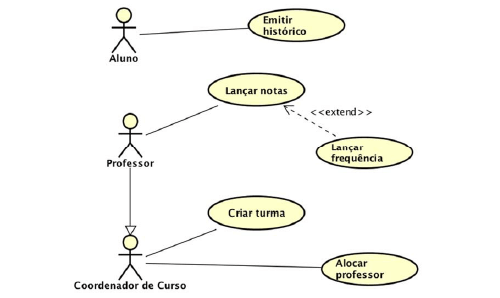
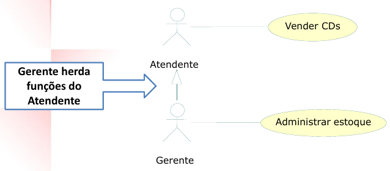
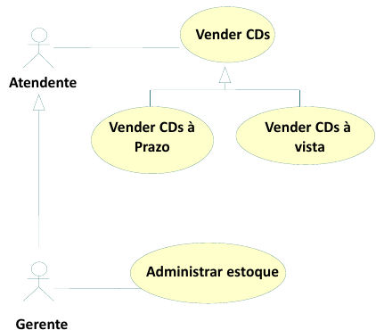
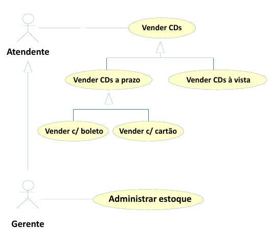
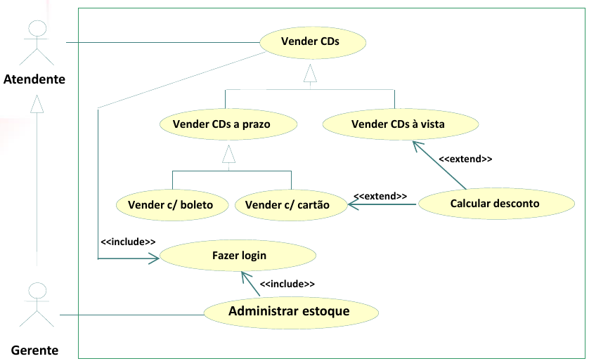

# Livraria da Ana

**IMPORTANTE**: [**Cadastre seu projeto nesse link**](https://docs.google.com/spreadsheets/d/1KXuMJ9TK7GPyahR_BfLwfn4ec7vX7DgiHx42vFc4E7g/edit?usp=sharing).

Professor: [Marco André Mendes](github.com/marcoandre)

Equipe:
- [Ana Heloiza](github.com/ana162)

**Links do projeto:**
-   [Documentação (esse documento)](github.com/ana162/pi-livraria-doc/)
-   Backend: [Repositório](https://github.com/ana162/livraria) e [Publicação](https://livraria-qc2t.onrender.com/)

# 1. Desenvolvimento
terão quatro tipos de livros romance,suspense,ação e comédia 
**Gerenciamento de vendas para uma livraria**

# 2. Situação Problema
  cadastro,endereço,site,aba de pesquisa, carrinho, pagamento 

o cliente escolhe o produto,coloca no carrinho,paga e leva o produto

Seguindo essas dicas, você deve ser capaz de descrever o dia-a-dia da empresa selecionada. E para ajudar na organização do texto, indicamos uma abordagem em 3 etapas:

-   **Introdução**:  (livraria da ana, vendas de livros, das 08h  as 18h, o dono, funcionários, etc);
-   **Situação-problema**: a livraria tera  varios tipos de livros,tera um sistema informatizado para facilitar as compras dos livros
-   **Conclusão**:A falta de um sistema de gestão adequado na livraria resultou em dificuldades como: Gestão de Estoque: Perda de controle sobre os livros em estoque, dificuldade em identificar os mais vendidos, e atrasos na reabastecimento, levando a falta de produtos e insatisfação dos clientes.Controle de Vendas: Dificuldade em analisar as vendas por livro, por categoria ou por período, impedindo a identificação de tendências e a tomada de decisões estratégicas para aumentar a rentabilidade.

# 3. Descrição da proposta
A solução proposta é um software de gestão que visa automatizar e simplificar processos, como a gestão de recursos, o controle de estoque e a comunicação interna.O foco é facilitar o trabalho dos funcionários, otimizar o tempo e melhorar a eficiência geral da empresa, especialmente nas áreas de maior dificuldade identificadas.
**Alguns pontos importantes a se destacar são:**

-   **Qual o foco de ação do software** O foco de ação de um software, relacionado aos problemas levantados na análise da situação-problema, define o que o software vai efetivamente fazer para resolver ou mitigar esses problemas. É a funcionalidade central, a razão de ser do software, como no exemplo do Gmail, que permite o envio e recebimento de e-mails.
-   **Os níveis de usuário do sistema**.Em uma livraria, os níveis de usuário do sistema podem variar dependendo das funções de cada funcionário. O gestor (ou administrador) geralmente tem acesso total, enquanto funcionários com               diferentes cargos podem ter acesso restrito a funcionalidades específicas, como consulta de produtos, gestão de estoque, ou atendimento ao cliente.
-   **O que poderá ser feito no software**.No software principal de uma livraria, poderíamos ter funcionalidades para gerir o catálogo de livros, realizar vendas e gerir os clientes.
-   **Se houver mais de um nível de usuário**,Se uma livraria tiver diferentes níveis de usuário (ex: clientes regulares, membros, parceiros), a descrição da proposta deve ressaltar as diferenças entre eles, especificando os benefícios e     privilégios de cada nível.  É crucial destacar como cada nível contribui para a comunidade e como a livraria se beneficia da presença de cada tipo de usuário.
-   
Tenha em mente que essa é uma etapa relativamente breve. Não é necessário um texto gigantesco, apenas dar uma noção do funcionamento do sistema. Mais adiante
precisaremos ser bem detalhistas, todavia agora a intenção é apenas fazer algo que permita ao cliente nos dizer se estamos no caminho certo.

# 4. Modelagem de Dados
A modelagem de dados para uma livraria, em termos de entidades e relacionamentos, envolve identificar elementos como livros, autores, categorias, clientes, pedidos, e formas de pagamento, além de seus atributos e como se relacionam.

# 4. Regras de negócio
A regra pode definir o mínimo de estoque de cada livro, garantindo que a loja não fique sem produtos populares.
Outra regra pode especificar o tempo máximo para um livro ficar em estoque antes de ser considerado para baixa ou promoção.
A regra pode detalhar como os livros devem ser armazenados e organizados para facilitar a identificação e o acesso.

**4.1 O que são regras de negócio?**

Gestão de estoque:
como a livraria calcula o estoque, quando os livros são reabastecidos, e como são identificados os livros de baixa rotatividade.
Processo de vendas:
como os livros são vendidos, se há descontos, como são processadas as devoluções.
Atendimento ao cliente:
como a livraria lida com reclamações e sugestões, como são geridos os dados dos clientes.
Parcerias e fornecedores:
como a livraria escolhe seus fornecedores, como são negociadas as condições de pagamento e frete.
**4.2 Regras para a criação de regras de negócio**
Definindo Regras de Negócio para uma Livraria:
1. Identifique as áreas de negócio:
Comece identificando as áreas principais de operação da livraria, como vendas, estoque, atendimento ao cliente, etc. 
2. Defina as regras para cada área:
Para cada área, estabeleça as regras que devem ser seguidas para garantir a eficiência e conformidade com os objetivos da livraria. 
3. Documente as regras:
As regras devem ser documentadas de forma clara e concisa, usando uma linguagem acessível para todos os envolvidos. 
De maneira geral, as regras de negócio devem:

**4.3 Por que ter regras de negócio?**

- **Padronização de processos:** As regras de negócio padronizam as atividades da livraria, como o processo de venda, estoque, cadastro de produtos, entre outros. Isso garante que todos os funcionários sigam o mesmo padrão, otimizando o     tempo e os recursos, e reduzindo erros e falhas. 
- **Controle de processos:** As regras de negócio facilitam o controle dos processos, pois permitem identificar e corrigir rapidamente qualquer desvio do padrão estabelecido. Por exemplo, se um cliente efetua uma compra online com um desconto não autorizado, a regra de negócio pode identificar e alertar a equipe para correção imediata. 
- **Tomada de decisão:**: As regras de negócio auxiliam na tomada de decisões estratégicas, como definir os critérios de desconto, promoções, condições de pagamento, entre outros. Isso garante que as decisões sejam baseadas em dados e critérios objetivos, e que a livraria cumpra suas metas de vendas e lucratividade. 
**4.4 Exemplos de regras de negócio**

Regras de negócio são diretrizes que determinam como uma livraria opera, afetando processos como venda, estoque, atendimento ao cliente e promoções. Exemplos incluem políticas de devolução, critérios de desconto, horários de funcionamento e procedimentos de venda online. 
Exemplos de Regras de Negócio para uma Livraria:
Venda e Atendimento:
Política de Devolução:
Livros podem ser devolvidos dentro de 7 dias após a compra, se estiverem em perfeito estado e com a embalagem original.
Descontos:
Produtos em promoção podem ter descontos de até 20% em relação ao preço original.
Horário de Funcionamento:
A livraria funciona de segunda a sábado, das 9h às 18h, e domingos das 10h às 14h.
Pagamentos:
Aceitam-se pagamentos em dinheiro, cartão de crédito e débito, além de outras formas de pagamento online.
Atendimento ao Cliente:
Os clientes devem ser atendidos de forma educada e profissional, com foco na satisfação do cliente.
Vendas Online:
A livraria oferece opções de compra online, com frete grátis para compras acima de R$ 100.
Entrega:
**4.5 Como escrever regras de negócio?**
Para escrever regras de negócio de forma eficiente e organizada, utilize um documento (planilha, documento online, etc.) que inclua campos para: número identificador, nome da regra, datas de criação e última alteração, nomes dos autores das versões, número da versão, identificadores das regras dependentes e uma descrição detalhada da regra. 

**4.6 Exemplos de regras de negócio com formatação**

- **RN01 – Criação Comanda:** Para iniciar um atendimento no balcão, é necessário primeiro abrir uma nova comanda.
- **RN02 – Inserir Produtos Comanda:** Para inserir um produto na comanda, é necessário que o produto esteja cadastrado no sistema e que a quantia comprada seja acima de zero.
- **RN03 – Cadastro de Leitores:** Os leitores precisam fazer o cadastro para realizar o empréstimo.
- **RN04 – Realizar Empréstimo:** Para realizar o empréstimo, apenas leitores com cadastro e nenhuma multa em aberto.
- **RN05 – Registro de Empréstimo:** O gerente deve possuir acesso aos registros de empréstimos.
- **RN06 – Pagamento de Multa:** O leitor que passar de 15 dias com o livro deverá pagar a multa de um real por dia de atraso.
- **RN07 – Impressão de Orçamento:** Com as informações do
orçamento registradas, a atendente deve imprimir o orçamento e
repassar ao cliente para aprovação, e caso o cliente aprovar, a atendente deve solicitar a sua assinatura para aprovar a execução do serviço.
- **RN08 – Abertura de OS:** Com o atendimento aprovado pelo cliente, a atendente deverá inserir os dados do cliente e do orçamento em um novo documento, para registros internos, realizando a abertura da OS.
- **RN09 – Relatório de Fluxo de Caixa:** O relatório de fluxo de caixa será permitido somente para o administrador.

# 5. Requisitos funcionais
Os requisitos funcionais de um sistema de livraria descrevem as funcionalidades específicas que o sistema deve oferecer, como cadastro de livros, gestão de estoque, processamento de vendas, etc. Eles especificam o que o sistema deve fazer para atender às necessidades do usuário e do negócio. 
Exemplos de requisitos funcionais para uma livraria:
Cadastro e Gestão de Livros:
O sistema deve permitir o cadastro de novos livros, com informações como título, autor, ISBN, preço, descrição, imagem, etc.
O sistema deve permitir a edição e atualização de informações dos livros cadastrados.
O sistema deve permitir a exclusão de livros do catálogo.
O sistema deve permitir a busca por livros, por diferentes critérios (título, autor, ISBN, etc.).
O sistema deve permitir a visualização detalhada das informações de cada livro.

**5.1 O que são requisitos funcionais?**
Os requisitos funcionais de uma livraria, no contexto de um sistema de gestão ou software, incluem a capacidade de registrar, consultar e gerenciar produtos (livros, revistas, etc.), realizar vendas, processar pagamentos, gerenciar estoque, realizar encomendas, gerar relatórios, entre outros. Também podem incluir recursos como gestão de clientes, sugestão de produtos, e integração com sistemas externos, como plataformas de e-commerce ou sistemas de transporte.
Um requisito funcional é uma declaração de como um sistema deve se comportar. Define o que o sistema deve fazer para atender às necessidades ou expectativas do usuário. Os requisitos funcionais podem ser pensados ​como recursos que o usuário detecta.

Os requisitos funcionais são compostos de duas partes:
**função** e **comportamento**.

- A **função**A função descreve o que o sistema deve fazer
- O **comportamento**  o comportamento descreve como o sistema deve executar essa função. Exemplos de funções: "Registrar uma venda", "Gerenciar o inventário", "Pesquisar livros". Exemplos de comportamentos: "O sistema deve registrar uma venda inserindo informações como livro, quantidade, preço e forma de pagamento", "O sistema deve atualizar o inventário diminuindo a quantidade de livros em estoque quando uma venda é registrada", "O sistema deve permitir a busca de livros por título, autor ou ISBN".
**5.2 Tipos de requisitos funcionais**

Os requisitos funcionais podem ser classificados em:

- Regulamentos de Negócios
- Requisitos de Certificação
- Requisitos de relatório
- Funções Administrativas
- Níveis de autorização
- Rastreamento de auditoria
- Interfaces Externas
- Gestão de dados
- Requisitos Legais e Regulamentares

**5.3 Diretrizes para a elaboração de requisitos funcionais**

Cada requisito funcional precisa ser:

- **Específico** O sistema deve permitir que o usuário cadastre um novo livro com título, autor, editora, ISBN, preço, descrição e quantidade em estoque.
- **Mensurável** O sistema deve ser capaz de cadastrar um novo livro em até 1 minuto.
- **Alcançável**O sistema deve ser desenvolvido utilizando tecnologias que sejam adequadas para a infraestrutura da livraria.
- **Relevante**O sistema deve permitir que o usuário pesquise por livro através do título, autor, editora ou ISBN.
- **Limitado**O sistema deve estar pronto e em funcionamento até o dia 31 de dezembro. 

**5.4 Estrutura do requisito funcional**

  Um requisito funcional, no contexto de uma livraria, deve ser estruturado de forma clara e detalhada, especificando o que o sistema deve fazer para atender às necessidades dos usuários

  - **Nome do requisito funcional:**"Sistema deve permitir que o usuário adicione livros ao carrinho"
  - **Dados necessários:** ID do livro, quantidade, preço."
  - **Usuários:**  Todos os usuários cadastrados e não cadastrados."
**5.4.1 Nome do requisito funcional**

**R.F. 99 - Nome do requisito funcional:** é o nome da função que o software terá. Sugerimos, por padronização, que tenha o prefixo R.F. (requisito funcional)
seguida da numeração, para melhor identificação do requisito, acrescido do formato *“Substantivo + onde será feita a ação”*.
Por exemplo:
- R.F. 01 - Registro de Funcionários
-R.F. 02 - Cadastro de Produtos
--R.F. 05 - Cálculo de Salários
Deixe para definir as numerações ao final, tendo em vista que mudanças podem acontecer e não é prático sempre ficar reajustando os números.

**5.4.2 Descrição do requisito funcional**
A descrição do requisito funcional deve detalhar a funcionalidade do sistema e o motivo de sua existência, especialmente se não for algo comum na empresa. O requisito deve ser claro sobre o que o sistema faz e por que é necessário para cumprir os objetivos do projeto.

**Descrição do requisito:**
Um requisito funcional para uma livraria online poderia ser: "O sistema deve permitir que os usuários cadastrem novos produtos, adicionando informações como título, autor, preço, descrição e imagem." O motivo da existência desse requisito é permitir que a livraria possa disponibilizar seu catálogo de livros online para os O que o sistema faz:clientes Define a ação específica que o sistema deve executar (ex: cadastrar produto, realizar pagamento, gerar relatório).
Por que o sistema faz isso: Explica a necessidade e o objetivo da ação, justificando a sua inclusão no sistema.

**5.4.3 Dados necessários**
Para gerir uma livraria de forma eficiente, são necessários dados relativos a clientes, livros, editoras e vendas. Estes dados são essenciais para controlar o estoque, gerir as finanças e otimizar as vendas.

**Dados necessários:** aqui devem ser colocados os nomes dos dados que serão usados para que esse requisito atenda o que precisa fazer.
Clientes:Nome completo,Endereço,Telefone, CPF ou CNPJ, Dados de pagamento, Histórico de compras. Livros:Título, Autor(es), ISBN, Editora, Gênero,Número de páginas,Sinopse,Preço, Quantidade em estoque, Data de publicação,Capa do livro.
Editoras:Nome,CNPJ, Endereço, Telefone.Vendas:Data da venda, Cliente que efetuou a compra, Livro(s) vendido(s), Preço total da venda, Forma de pagamento,Desconto aplicado (se houver). 

Nas **entradas** e **processos**, em geral, são os dados que serão salvos (seja algo digitado pelo usuário ou captado do sistema, como a hora atual).
Título do livro (informado pelo usuário),Autor(es),Editora,Gênero,Ano de publicação,ISBN,Preço,Quantidade em estoque,Data e hora do cadastro (capturada automaticamente pelo sistema).
Processos:Validação dos campos obrigatórios, Verificação do formato do ISBN, Armazenamento dos dados no banco de dados,Registro da data e hora do cadastro,Verificação se o livro já existe no sistema (pelo ISBN) para evitar duplicidade.

Já nas **saídas**Saídas:Mensagem de confirmação de cadastro bem-sucedido, Exibição dos dados cadastrados,Mensagens de erro em caso de campos inválidos ou duplicidade de ISBN.

**5.4.4 Usuários**
Administrador,Funcionário da livraria com permissão de cadastro

**Usuários:** aqui devem ser colocados os nomes dos usuários que terão acesso a esse requisito, conforme enumerados na descrição do sistema.
Administrador – tem acesso completo, inclusive a configurações e relatórios.
Funcionário – realiza cadastros, vendas e consultas.
Cliente – acessa o catálogo, realiza compras e consulta pedidos.
Fornecedor – cadastra ofertas e consulta pedidos de reposição (se aplicável).

**5.4.5 Exemplo de requisito funcional**
1. Cadastro de Livros
O sistema deve permitir o cadastro de livros com as seguintes informações: título, autor, editora, gênero, ISBN, preço e quantidade em estoque.
2. Cadastro de Usuários
O sistema deve permitir que o administrador cadastre novos usuários com seus respectivos perfis (administrador, funcionário, cliente, fornecedor).
3. Realizar Venda
O sistema deve permitir que um funcionário ou cliente registre a venda de um ou mais livros, calculando o valor total e atualizando o estoque.
4. Controle de Estoque
O sistema deve permitir ao administrador ou funcionário consultar e alterar o estoque de livros.
5. Consulta de Catálogo
O sistema deve permitir a pesquisa de livros pelo título, autor, gênero ou ISBN.

- **R.F. 01 - Autenticação de usuário:** Este requisito tem como objetivo autenticar o acesso ao sistema da livraria. O sistema deve verificar se as credenciais informadas (login e senha) correspondem a um usuário cadastrado e ativo. Em caso de sucesso, o sistema deve redirecionar o usuário para a página principal correspondente ao seu perfil de acesso (ex: administrador, atendente, cliente etc.).
  - **Dados necessários:** Login (e-mail ou nome de usuário),Senha,
  - Nível de permissão (cliente, atendente, administrador etc.).

  - **Usuários:**Clientes cadastrados
  - Atendentes da livraria
    Administradores do sistema

**5.4.6 Organização dos requisitos funcionais**

As funcionalidades devem ser organizadas em: entradas, processos e saídas.

**Entradas:** São as funcionalidades que permitem inserir dados no sistema, fornecendo as informações essenciais para seu funcionamento.
**Exemplos de entradas:**Registro de usuário: cadastro de clientes, atendentes e administradores para permitir o acesso ao sistema.
Cadastro de livro: inserção de novos títulos no acervo, com dados como título, autor, editora, ISBN, preço e estoque.
Cadastro de fornecedor: entrada de dados dos fornecedores de livros.
Cadastro de categorias/genres: classificação dos livros (ex: romance, ficção científica, técnico, etc.).
Cadastro de pedidos de compra: inserção de dados de novos pedidos realizados por clientes.

- “**Registro de usuário**permite o cadastro de clientes, atendentes ou administradores no sistema. Esse cadastro é essencial para controle de acesso e para personalizar as funcionalidades       disponíveis conforme o perfil do usuário.
  Exemplo: Um cliente se cadastra com nome, e-mail, CPF e endereço para poder realizar compras na loja online.
- “**Registro de paciente** evita a necessidade de inserir os mesmos dados sempre que for feita uma venda ou consulta. Cada livro é registrado com informações como título, autor, editora, ISBN, preço e quantidade em estoque.
Exemplo: O administrador cadastra o livro "Dom Casmurro" com todas as informações necessárias para que ele esteja disponível no sistema.

**Processos:** Recibo de compra: comprovante gerado após uma venda, contendo os detalhes da transação.
Relatório de vendas: exibe as vendas realizadas por período, por livro ou por atendente.
Relatório de estoque: lista os livros disponíveis, os que estão com baixo estoque ou esgotados.
Notificação de confirmação de pedido: mensagem enviada ao cliente confirmando a realização do pedido, com status de entrega.
Painel de controle do administrador: exibe estatísticas e informações gerenciais, como volume de vendas, livros mais vendidos, desempenho por categoria.

**Exemplos de processos:**autenticação de usuário
Verifica se o login e senha informados são válidos e direciona o usuário para seu painel, conforme o perfil (cliente, atendente, administrador).
Busca de livros no catálogo
Permite localizar livros com base em critérios como título, autor, gênero, editora, ISBN, ou palavras-chave.
Processamento de venda
Calcula o valor total da compra, aplica descontos, atualiza o estoque e registra a transação.
Atualização de estoque
Ajusta automaticamente a quantidade de livros disponíveis após uma venda ou reposição.
- “**Autenticação de usuário**”, que usará os dados de “**Registro de usuário**” em sua execução.
- “**Agendamento de consulta**”, que usará dados do “**Registro de paciente**” e talvez do “**Registro de funcionário**” em sua execução.

**Saídas:**Recibo de compra: comprovante gerado após uma venda, contendo os detalhes da transação.
Relatório de vendas: exibe as vendas realizadas por período, por livro ou por atendente.
Relatório de estoque: lista os livros disponíveis, os que estão com baixo estoque ou esgotados.
Notificação de confirmação de pedido: mensagem enviada ao cliente confirmando a realização do pedido, com status de entrega.
Painel de controle do administrador: exibe estatísticas e informações gerenciais, como volume de vendas, livros mais vendidos, desempenho por categoria.

**Exemplos de saídas:**
- "Relatório de compras por cliente”
- " Relatório de vendas”.
- “Log de usuários autenticados”.

Todos esses podem ser consideradas saídas, pois usam informações de entradas e processos de modo a mostrar informações relevantes ao
negócio. Lembre-se que, diferentemente das entradas e processos, aqui os dados necessários devem ser os que a tela exibirá.

**5.4.7 Exemplo de organização dos requisitos funcionais**
| **Entrada**                                           | **Processo**                                         | **Saída**                                  |
| ----------------------------------------------------- | ---------------------------------------------------- | ------------------------------------------ |
| Dados do cliente (nome, CPF, endereço, etc.)          | Cadastrar novo cliente                               | Confirmação de cadastro do cliente         |
| Informações do livro (título, autor, preço, etc.)     | Cadastrar livro no sistema                           | Livro disponível no catálogo               |
| Login (usuário e senha)                               | Verificar credenciais de acesso                      | Acesso concedido ou mensagem de erro       |
| Código do livro e quantidade                          | Realizar venda                                       | Recibo da venda e atualização do estoque   |
| Termo de busca (palavra-chave ou categoria)           | Buscar livros no catálogo                            | Lista de livros encontrados                |
| Dados do pedido (itens, endereço, forma de pagamento) | Processar pedido de compra                           | Pedido confirmado com número de rastreio   |
| Código do pedido                                      | Consultar status do pedido                           | Status atual do pedido exibido             |
| Requisição de relatório de vendas                     | Gerar relatório de vendas por período                | Arquivo de relatório com dados organizados |
| Solicitação de atualização de estoque                 | Atualizar quantidade em estoque de determinado livro | Estoque atualizado com nova quantidade     |

**Entradas:**

- **R.F. 01 - Nome do requisito funcional:** Cadastro de Usuário: permite que um novo cliente se registre na livraria.
  - **Dados necessários:**nome completo, e-mail, CPF, endereço, senha.
  - **Usuários:* cliente.

- **R.F. 02 - Nome do requisito funcional:**- Busca de livros: permite ao usuário pesquisar livros no catálogo da loja.
  - **Dados necessários:** título, autor, ISBN, palavra-chave, categoria.
  - **Usuários:** todos os níveis de usuário.

**Processamento:**
- **R.F. 03 - Nome do requisito funcional:** Processar venda: realiza o cálculo do total, aplica descontos, atualiza estoque e registra a compra.
  - **Dados necessários:**itens do carrinho, forma de pagamento, dados do cliente.
  - **Usuários:** cliente, atendente.

- **R.F. 04 - Nome do requisito funcional:**  Atualizar estoque: altera automaticamente a quantidade de livros após venda ou reposição.
  - **Dados necessários:** código do livro, quantidade movimentada, tipo de operação.
  - **Usuários:**administrador, atendente.
**Saídas:**

- **R.F. 05 - Nome do requisito funcional:** Gerar recibo de compra: emite um comprovante da transação para o cliente.
  - **Dados necessários:** dados da compra (livros, valores, data, cliente).
  - **Usuários:** cliente, atendente.
  - 
- **R.F. 06 - Nome do requisito funcional:**  Relatório de vendas: apresenta vendas realizadas por período, por livro ou por atendente.
  - **Dados necessários:** intervalo de datas, filtros por categoria, atendente ou título.
  - **Usuários:**administrador.
# 6. Requisitos não funcionais
Requisitos não funcionais (RNFs) são as restrições impostas ao sistema da livraria que definem seus atributos de qualidade.
Eles geralmente são expressos por adjetivos como seguro, rápido, escalável, entre outros. No contexto de uma livraria, esses requisitos garantem que o sistema funcione de forma eficiente, confiável e segura para clientes e funcionários.

**6.1 Categorias de requisitos não funcionais**
Requisitos não funcionais (RNFs) definem as características de qualidade e restrições de um sistema, enquanto os requisitos funcionais descrevem o que o sistema faz. Para uma livraria, RNFs podem incluir critérios de desempenho (como tempo de resposta ao buscar um livro), segurança (proteção de dados do cliente), confiabilidade (disponibilidade do sistema), usabilidade (facilidade de uso da interface) e manutenibilidade (facilidade de atualização). 

Os Requisitos Não Funcionais explicam as limitações e restrições do sistema a ser projetado. **Esses requisitos não têm nenhum
impacto na funcionalidade do aplicativo.** Além disso, existe uma prática comum de subclassificar os requisitos não funcionais em várias categorias:
- Interface de Usuário:A facilidade de uso, a intuitividade e a aparência da interface do sistema. 
- Confiabilidade:A capacidade do sistema de funcionar sem falhas e de forma consistente ao longo do tempo, incluindo a capacidade de recuperação de falhas. 
- Segurança:A proteção dos dados do usuário e do sistema contra acessos não autorizados e ataques maliciosos. 
- Atuação: A velocidade e eficiência com que o sistema responde às ações do usuário, incluindo tempo de resposta, taxa de transferência e utilização de recursos. 
- Manutenção:A facilidade com que o sistema pode ser corrigido, atualizado e mantido. 

Os requisitos não funcionais podem ser divididos em duas categorias:

1. **Atributos de qualidade:** Segurança: A proteção contra ameaças e ataques.
Desempenho: A eficiência e velocidade do sistema.
Usabilidade: A facilidade de uso e a experiência do usuário.
Confiabilidade: A capacidade do sistema de funcionar corretamente e sem falhas.
Manutenibilidade: A facilidade de atualização e manutenção do sistema. 
2. **Restrições:** Tempo: O prazo para a entrega do sistema.
Recursos: Os recursos disponíveis para o desenvolvimento do sistema, como orçamento e pessoal.
Ambiente: O ambiente em que o sistema será executado.

**6.2 Vantagens dos requisitos não funcionais**

Os requisitos não funcionais ajudam a garantir que o sistema seja:
1. Adaptado às necessidades do usuário:Requisitos não funcionais, como usabilidade e desempenho, garantem que o sistema seja intuitivo e responsivo, proporcionando uma experiência de compra agradável e eficiente para os clientes da livraria. 
2. Adequado à finalidade:Requisitos como segurança e confiabilidade garantem que a livraria online opere de forma segura e confiável, protegendo os dados dos clientes e evitando interrupções no serviço. 
3. Escalável:Um sistema escalável pode lidar com um aumento no número de usuários e transações, o que é essencial para o crescimento de uma livraria online, evitando gargalos e lentidão durante picos de acesso. 
4. Seguro:A segurança é fundamental para proteger informações sensíveis dos clientes, como dados de cartão de crédito e informações pessoais. Requisitos não funcionais relacionados à segurança garantem que a livraria online esteja protegida contra ataques cibernéticos e fraudes. 
5. Confiável:A confiabilidade garante que a livraria online funcione sem falhas e que os clientes possam acessar seus serviços e produtos sem interrupções. Isso inclui a capacidade de lidar com falhas e recuperar rapidamente, garantindo a satisfação do cliente. 
6. Fácil de usar e manter:Requisitos de usabilidade e manutenibilidade garantem que a livraria online seja fácil de usar para os clientes e fácil de manter para os desenvolvedores. Uma interface intuitiva e um código bem estruturado facilitam a navegação e a atualização do sistema. 

**6.3 Exemplos de requisitos não funcionais**

Aqui estão alguns exemplos de requisitos não funcionais:
1. **Segurança**:O sistema deve proteger os dados dos clientes (informações pessoais, detalhes de pagamento) contra acesso não autorizado, utilizando criptografia e outras medidas de segurança. 
A plataforma deve ser resistente a ataques cibernéticos, como injeção de SQL ou ataques DDoS. 
2. **Atuação**:A página de detalhes de um livro (com sinopse, preço, avaliações e capa) deve ser carregada em até 1,5 segundos.A página de detalhes de um livro (com sinopse, preço, avaliações e capa) deve ser carregada em até 1,5 segundos.
3. **Escalabilidade**:O sistema deve ser capaz de lidar com picos de tráfego durante promoções ou lançamentos de livros populares.
O sistema deve permitir a adição de novos livros, categorias e funcionalidades sem afetar o desempenho geral.
4. **Disponibilidade**:A livraria online deve estar disponível 24 horas por dia, 7 dias por semana, com um tempo de inatividade mínimo (por exemplo, 99,9% de disponibilidade).
O sistema deve ter mecanismos de backup e recuperação para garantir a continuidade do serviço em caso de falhas. 
5. **Manutenção**:O sistema deve ser desenvolvido de forma modular, de modo que alterações em um módulo (ex: catálogo de livros) não afetem negativamente outros módulos (ex: carrinho de compras).O sistema deve ser desenvolvido de forma modular, de modo que alterações em um módulo (ex: catálogo de livros) não afetem negativamente outros módulos (ex: carrinho de compras).
6. **Portabilidade**:O sistema deve ser compatível com diferentes navegadores web (Chrome, Firefox, Safari, etc.) e dispositivos (computadores, tablets, smartphones).
O sistema deve ser capaz de rodar em diferentes sistemas operacionais (Windows, macOS, Linux) com alterações mínimas.
7. **Confiabilidade**: O sistema deve ser estável e confiável, com um baixo índice de erros e falhas.
O sistema deve ser capaz de lidar com erros e exceções de forma elegante, sem interromper a experiência do usuário.
8. **Usabilidade**: A navegação no site deve ser intuitiva e fácil de usar, permitindo que os usuários encontrem rapidamente o que procuram.
A interface do usuário deve ser clara e consistente, com botões e menus bem definidos.
9. **Compatibilidade**O sistema deve ser compatível com outros sistemas, como sistemas de pagamento online, sistemas de gerenciamento de estoque e sistemas de entrega.
O sistema deve ser capaz de integrar com APIs de terceiros para funcionalidades adicionais (por exemplo, sistemas de recomendação de livros). 
10. **Conformidade**: O sistema deve cumprir todas as leis e regulamentos aplicáveis, como leis de proteção de dados (LGPD, GDPR) e leis de comércio eletrônico.
O sistema deve fornecer informações claras sobre termos e condições, política de privacidade e informações de contato.
**6.4 Exemplo de organização dos requisitos não funcionais**
| **Categoria**        | **Requisito Não Funcional**                                                                                                |
| -------------------- | -------------------------------------------------------------------------------------------------------------------------- |
| **Desempenho**       | O sistema deve ser capaz de processar uma venda em até 2 segundos.                                                         |
| **Disponibilidade**  | O sistema deve estar disponível para acesso 24 horas por dia, 7 dias por semana.                                           |
| **Segurança**        | As senhas dos usuários devem ser armazenadas de forma criptografada.                                                       |
| **Usabilidade**      | A interface deve ser intuitiva e permitir que novos usuários façam sua primeira compra em até 5 minutos.                   |
| **Portabilidade**    | O sistema deve ser compatível com os navegadores Chrome, Firefox e Safari.                                                 |
| **Confiabilidade**   | O sistema deve apresentar no máximo 1 falha crítica a cada 100 mil transações.                                             |
| **Manutenibilidade** | O código do sistema deve ser modularizado e documentado para facilitar futuras manutenções.                                |
| **Escalabilidade**   | O sistema deve suportar o aumento de até 10 vezes no número de usuários simultâneos sem perda significativa de desempenho. |

**Requisitos não funcionais:**

- R.N.F. 01 – Desempenho: O sistema deve ser capaz de processar uma venda em até 2 segundos.
- R.N.F. 02 – Disponibilidade: O sistema deve estar disponível 24 horas por dia, 7 dias por semana.
**Exemplos de requisitos não funcionais:**
R.N.F. 01 – Desempenho: O sistema deve processar cada transação de venda em até 2 segundos.
R.N.F. 02 – Disponibilidade: O sistema deve estar acessível 24 horas por dia, 7 dias por semana.
R.N.F. 03 – Segurança: As senhas devem ser criptografadas e o acesso deve ser feito via conexão segura (HTTPS).
R.N.F. 04 – Usabilidade: A interface do sistema deve ser simples e intuitiva, permitindo navegação sem necessidade de treinamento prévio.
R.N.F. 05 – Confiabilidade: O sistema deve manter a integridade dos dados mesmo em caso de falhas de energia ou conexão.
R.N.F. 06 – Escalabilidade: O sistema deve comportar aumento de usuários sem perda significativa de desempenho.
R.N.F. 07 – Portabilidade: O sistema deve funcionar em diferentes navegadores e dispositivos móveis.
R.N.F. 08 – Manutenibilidade: O código-fonte do sistema deve ser modular e documentado, facilitando atualizações e correções futuras.

**Sistema de livraria**:
- **R.N.F. 01 - Navegador homologado:** O sistema deve funcionar corretamente nos navegadores Google Chrome e Mozilla Firefox.
- **R.N.F. 02 - Processador:** É recomendado o uso de um processador Intel i3 (ou similar, como a geração 7100) ou AMD Ryzen 3 (ou similar, como a geração 3100) para garantir um bom desempenho do servidor.
- **R.N.F. 03 - Memória RAM:** É recomendável que o sistema utilize no mínimo 2GB de memória RAM para um funcionamento eficiente.
- **R.N.F. 04 - Arquitetura:** A arquitetura do sistema deve ser baseada em Modelo-Visão-Controle (MVC), com uma API REST para comunicação com o banco de dados.
- **R.N.F. 05 - Banco de dados:** O sistema será implementado utilizando o banco de dados MySQL.
- **R.N.F. 06 - Conexão com banco de dados:** A conexão com o banco de dados será realizada através do MySQL Connector.
- **R.N.F. 07 - Implementação:** A linguagem de programação utilizada no desenvolvimento do sistema será Python, juntamente com Javascript, HTML5, CSS3 e SQL.
- **R.N.F. 08 - Segurança:** A segurança do sistema, incluindo o controle de acesso e permissões, será de responsabilidade do estabelecimento.
- **R.N.F. 09 - Ambiente de Desenvolvimento Integrado (IDE):** O editor de texto Visual Studio Code será utilizado para o desenvolvimento do sistema.
- **R.N.F. 10 - Disponibilidade:** O sistema deverá estar disponível para uso em 99% do tempo, com exceção de problemas de rede ou energia que possam afetar as operações de cadastro, remoção, inserção ou alteração de dados.
- **R.N.F. 11 - Legais:** O sistema deve estar em conformidade com a Lei Geral de Proteção de Dados (LGPD). 

**Sistema de Ordem de Serviço:**
- **R.N.F. 01 - Navegadores homologados:** O sistema deve funcionar corretamente nos navegadores Google Chrome e Mozilla Firefox. 
- **R.N.F. 02 - Tecnologia Front-end:** O sistema utilizará as tecnologias HTML5 e CSS3 para a parte visual, e o framework Vue.js para facilitar o desenvolvimento. 
- **R.N.F. 03- Tecnologia Back-end:**  desenvolvimento do back-end será realizado utilizando a linguagem Python, com o framework Django, e a API REST será implementada com o Django REST Framework.
- **R.N.F. 04 - Interoperabilidade:** O sistema armazenará os dados em um banco de dados MySQL, utilizando a linguagem SQL. O gerenciamento do banco de dados será feito através do MySQL Workbench.
- **R.N.F. 05 - Forma de uso do software:** Apesar de ser um sistema interno, o sistema será disponibilizado 24 horas por dia, 7 dias por semana.
- **R.N.F. 06 - Desempenho:**  Recomenda-se o uso do sistema com um sistema operacional atualizado, um processador Intel i3 de 5ª geração ou similar, e 8GB de memória RAM, além dos navegadores homologados.
- **R.N.F. 07- Autenticação:** A autenticação no sistema será feita por meio de usuários criados pelo administrador, com a possibilidade de solicitar a redefinição de senha.
- **R.N.F. 08 - Web Server:** O servidor web utilizado será o Apache Tomcat em suas versões mais recentes.
- **R.N.F. 09 - Níveis de segurança:** : O sistema deverá ter diferentes níveis de acesso para cada tipo de usuário, com permissões específicas para cada função.
**6.6 Conclusão**
Requisitos não funcionais são cruciais para garantir que o sistema atenda às necessidades dos usuários e funcione corretamente. É fundamental considerar cuidadosamente todos esses requisitos durante o desenvolvimento do sistema.

É importante considerar cuidadosamente todos os requisitos não funcionais antes de projetar e desenvolver um sistema.
Eles ajudam a garantir que o sistema atenda às necessidades do usuário e seja capaz de funcionar como pretendido.

# 7. Diagrama de Caso de Uso
| **Caso de Uso**             | **Descrição**                                              | **Atores Envolvidos** |
| --------------------------- | ---------------------------------------------------------- | --------------------- |
| Cadastrar Cliente           | Registrar os dados de um novo cliente.                     | Atendente             |
| Consultar Catálogo          | Buscar e visualizar livros disponíveis na livraria.        | Cliente, Atendente    |
| Adicionar Livro ao Carrinho | Escolher livros para realizar a compra.                    | Cliente               |
| Realizar Venda              | Efetuar a venda dos livros selecionados.                   | Cliente, Atendente    |
| Processar Pagamento         | Efetuar e validar o pagamento da compra.                   | Sistema de Pagamento  |
| Emitir Nota Fiscal          | Gerar comprovante da compra.                               | Sistema               |
| Gerenciar Estoque           | Adicionar ou remover livros do estoque.                    | Atendente, Gerente    |
| Cadastrar Novo Livro        | Inserir um novo livro no catálogo da livraria.             | Atendente, Gerente    |
| Gerar Relatórios de Venda   | Obter estatísticas e relatórios de vendas e movimentações. | Gerente               |
| Validar Senha de Acesso     | Verificar a identidade para uso do sistema.                | Atendente, Gerente    |

**7.1 Introdução**
Para uma livraria, um diagrama de caso de uso detalha as interações entre os usuários (clientes, atendentes, gerentes, etc.) e o sistema. Ele mostra funcionalidades como buscar livros, verificar disponibilidade, realizar vendas, registrar clientes, adicionar livros ao catálogo e gerar relatórios. O diagrama também evidencia as relações entre os casos de uso e os atores envolvidos, permitindo uma visão clara das funcionalidades oferecidas.

-Especificam a visão externa do sistema.
- Descrevem como o sistema é percebido por seus usuários.
- Representam as interações entre os usuários e o sistema.

**Os casos de uso:**
- Descrevem como os usuários interagem com o sistema, ou seja, representam as funcionalidades que o sistema oferece a partir da perspectiva do usuário.
- Facilitam a organização dos requisitos funcionais, permitindo uma compreensão mais clara do que o sistema deve fazer.
- Proporcionam uma visão externa do sistema, sem revelar os detalhes de implementação.
- O conjunto de casos de uso deve ser capaz de comunicar a funcionalidade e o comportamento do sistema de forma compreensível para o cliente e para os desenvolvedores.
- Focam em o que o sistema faz, mas não detalham como essas funcionalidades são implementadas.

**7.2 Elementos do diagrama de caso de uso**
Os elementos de um diagrama de caso de uso ajudam a representar as funcionalidades do sistema e a forma como diferentes usuários interagem com ele. Abaixo, estão os principais componentes utilizados nesse tipo de diagrama:
7.2.1 **Atores**

- Representam os papéis desempenhados por elementos externos ao sistema.
- Ex:ser humano (usuário), dispositivo de hardware ou outro sistema (ex: serviço de pagamento).
- São os elementos que interagem com o sistema, solicitando ou recebendo algum tipo de serviço.
Os atores são representados por um boneco (stickman).
O nome do ator deve aparecer abaixo da figura, em letras legíveis.

Notação:
     _______
    |       |
    | Cliente |
    |_______|
        |
      \ O /
        |
       / \

**Exemplo:Livraria

**Identificando os atores**
- Uma livraria possui diversos livros para venda. Um cliente pode entrar na livraria e escolher os livros que deseja comprar, mas para isso ele deve se dirigir à loja física.
- A livraria possui um atendente cuja função é registrar as vendas e atender os clientes durante o processo de compra, utilizando o sistema informatizado.
- A livraria também conta com um gerente, responsável por administrar o estoque, controlar as vendas e conceder autorizações no sistema, como descontos ou promoções. Além disso, ele pode substituir o atendente quando necessário.

**E o cliente?**
-O cliente não é ator, pois ele não interage diretamente com o sistema. Ele interage com a loja, mas quem utiliza o sistema para registrar as ações são o atendente e o gerente.

**7.2.2 Casos de uso**
- Uma livraria possui diversos livros para venda. Um cliente pode escolher quantos livros desejar, para isso ele deve se dirigir à livraria ou acessar o sistema online.
- A livraria possui um atendente cuja função é registrar as vendas no sistema e atender os clientes durante a compra dos livros.
- A livraria também conta com um gerente, que administra o estoque para garantir que não faltem livros disponíveis. Além disso, o gerente pode autorizar descontos e folgas para o atendente, ou seja, ele também pode atender os clientes durante as vendas.

> **Dica**: nomeie os casos de uso com **verbos** no **infinitivo**.
Notação:Os casos de uso são representados por elipses ovais contendo o nome da funcionalidade.
O nome deve ser claro, curto e em verbo no infinitivo.
Os casos de uso se conectam aos atores que os executam.

**Exemplo: Livraria

**Identificando os casos de uso**

- Uma livraria possui diversos livros para venda. Um cliente pode comprar quantos livros desejar, para isso ele deve se dirigir à livraria ou acessar o sistema online.
- A livraria possui um atendente cuja função é atender os clientes durante a venda dos livros, registrando as vendas no sistema.
-A livraria também possui um gerente cuja função é administrar o estoque para garantir que não faltem livros disponíveis. Além disso, ele é responsável por conceder folgas ao atendente e também pode atender os clientes quando necessário.

**7.2.3 Relacionamentos**
Os relacionamentos em um Diagrama de Caso de Uso representam como os atores interagem com os casos de uso. Eles também mostram a dependência entre os casos de uso (inclusão, extensão e generalização).
| **Ator**  | **Casos de Uso**                                                                 |
| --------- | -------------------------------------------------------------------------------- |
| Cliente   | Comprar livros (presencial ou online)                                            |
| Atendente | Registrar venda de livros                                                        |
| Gerente   | Administrar estoque Conceder folga ao atendente Atender cliente (opcional) |

**7.2.3.1 Relacionamento de associação**

- Indica que um ator participa de um caso de uso, ou seja, o ator interage ou se comunica com o caso de uso.
- É representado por uma linha sólida que conecta o ator ao caso de uso.
- Um ator pode estar relacionado a um ou mais casos de uso, conforme suas funções ou interações com o sistema.
> Dicas:
> - Não use setas nas linhas de associação.
> - Associações não representam fluxo de informação.

**Exemplo: Livraria

**Identificando os relacionamentos de associação**

- A livraria possui livros, que são o produto principal. 
- A livraria também possui um gerente, cuja função é administrar o estoque para que não faltem livros.

**7.2.3.2 Relacionamento de generalização/especialização**
O relacionamento de generalização/especialização é utilizado quando dois ou mais atores ou casos de uso compartilham comportamentos semelhantes, mas alguns possuem funcionalidades específicas adicionais.
Nesse relacionamento:
Um ator mais genérico (pai) define comportamentos comuns.
Os atores mais específicos (filhos) herdam esses comportamentos e podem acrescentar outros.
Notação: seta com ponta aberta e linha contínua, apontando do ator/caso de uso mais específico para o mais geral.
Exemplo aplicado à livraria:
O Gerente é uma especialização do Atendente, pois:
Pode fazer tudo o que o atendente faz (registrar venda, atender cliente);
Além disso, pode administrar o estoque e conceder folgas.
📌 Generalização entre atores:
          [Atendente]
              ▲
              |
           [Gerente]

Ou graficamente em UML:
Gerente → Atendente (seta de generalização)
**Generalização de atores**

-O ator Funcionário representa um papel genérico que pode se comunicar com um conjunto de casos de uso como: fazer login, consultar livros, verificar estoque. 
-  O ator Atendente herda as características de Funcionário e também pode realizar vendas e emitir nota fiscal.
–O ator Gerente também herda de Funcionário e possui casos de uso adicionais, como gerar relatórios e autorizar descontos.
> **Dica:** coloque os herdeiros **embaixo**.

**Notação:**
Representada por uma seta com ponta branca (triângulo vazio) apontando do ator mais específico (filho) para o ator mais genérico (pai).
Exemplo UML textual:
[Atendente] ----▸ [Funcionário]
[Gerente]   ----▸ [Funcionário]
 Ambos herdam os casos de uso do ator Funcionário, mas também possuem funcionalidades próprias.

**Exemplo: Livraria

**Identificando os relacionamentos de generalização/especialização de atores**
A generalização de atores é usada quando dois ou mais atores compartilham casos de uso em comum.
Permite organizar e simplificar o diagrama, criando um ator genérico (pai) que representa comportamentos comuns e atores especializados (filhos) que herdam esses comportamentos.
Os atores filhos também podem possuir casos de uso próprios, além dos herdados.
Ator pai:
Funcionário
Pode realizar ações comuns como:Fazer login
Consultar catálogo
Acessar sistema de estoque
Atores especializados:
Atendente
Herda as ações do ator Funcionário
Pode realizar vendas e emitir nota fiscal

**Generalização de casos de uso**

– .O caso de uso filho herda o comportamento e o significado do caso de uso pai.
–  O caso de uso filho pode adicionar novas etapas ou sobrescrever (alterar) partes do comportamento herdado. 
–  O caso de uso filho pode ser usado no lugar do caso de uso pai sempre que necessário.

> **Dica:** deve ser aplicada quando uma condição resulta na definição de
diversos fluxos alternativos.

Notação:Representada por uma linha contínua com uma seta branca (triângulo vazio) apontando do caso de uso filho para o caso de uso pai.
Exemplo de notação UML:
[Venda Presencial] --------▸ [Realizar Venda]
[Venda Online]     --------▸ [Realizar Venda]

**Exemplo: Livraria

**Identificando os relacionamentos de generalização/especialização de casos de uso**
A generalização/especialização de casos de uso ocorre quando um caso de uso genérico (pai) pode ser dividido em versões mais específicas (filhos), com comportamentos diferentes dependendo de certas condições.
Os casos de uso filhos herdam o comportamento do pai, podendo acrescentar, modificar ou substituir partes do seu fluxo.

**Novos requisitos:**

  - As vendas podem ser feitas à vista ou a prazo.
  Em ambos os casos, o estoque de livros é atualizado e uma nota fiscal é emitida para o cliente.
  -Clientes cadastrados na livraria que compram mais de 5 livros de uma só vez ganham um desconto de 1% para cada ano de cadastro.
  -A venda pode ser parcelada em 2 vezes, com um acréscimo de 20% sobre o valor total.
  -Boleto: são gerados boletos bancários entregues ao cliente e armazenados no sistema para lançamento posterior no caixa.
  - Cartão: clientes com mais de 10 anos de cadastro ganham o mesmo desconto da venda à vista.

**Identificando mais relacionamentos de generalização/especialização de casos de uso**
Caso de uso pai:Realizar venda → representa o processo padrão de venda de livros.
Casos de uso filhos (especializações):Realizar venda à vista
Especializa o caso de uso "Realizar venda".
Aplica desconto por fidelidade (ex: 1% por ano de cadastro).
Pagamento imediato e emissão de nota fiscal.
Realizar venda a prazo
Também especializa "Realizar venda".
Permite parcelamento em até 2 vezes com acréscimo.
Pode gerar boleto ou processar cartão.

**7.2.3.3 Relacionamento de dependência**
No Diagrama de Caso de Uso, os relacionamentos de dependência indicam como um caso de uso depende de outro para complementar ou reutilizar funcionalidades. Os principais tipos são:
Extensão (<<extend>>):
Representa uma variação ou complemento no comportamento de um caso de uso base.
O caso de uso estendido acontece apenas sob condições específicas.
Permite separar o que é obrigatório (fluxo principal) do que é opcional ou condicional (comportamentos adicionais).
Exemplo: Caso de uso base: Realizar venda
Caso de uso estendido: Aplicar desconto por fidelidade (aplica-se somente se o cliente atender a critérios específicos).
Notação: Linha tracejada com seta aberta apontando do caso de uso estendido para o caso base, com o rótulo <<extend>>.
**Extensão**

- Representa uma variação ou complemento no comportamento de um caso de uso base do sistema da livraria.
- O caso de uso estendido acontece apenas sob certas condições específicas.
- Permite separar o que é obrigatório (fluxo principal) do que é opcional ou condicional (comportamentos adicionais).
 - Caso de uso estendido: Aplicar desconto por fidelidade
Ocorre somente se o cliente estiver cadastrado há mais de 5 anos e comprando mais de 5 livros.
Essa extensão adiciona um desconto automático ao valor final da compra.
- Caso de uso base: Realizar venda
Descreve o processo padrão para vender livros, incluindo seleção dos livros, pagamento e emissão da nota fiscal.
**Notação:** Representada por uma linha tracejada com uma seta aberta (ponta de flecha) apontando do caso de uso estendido para o caso de uso base.
A linha é rotulada com o estereótipo <<extend>>.
Exemplo visual (UML):
[Aplicar desconto por fidelidade] -- - - -▸ <<extend>> -- - - - [Realizar venda]

 - notação")

**Exemplo:Livraria

**Identificando os relacionamentos de dependência (extensão)**
Representada por uma linha tracejada com uma seta aberta apontando do caso de uso estendido para o caso de uso base.
A linha é identificada com o estereótipo <<extend>>.

**Novos requisitos:**
- No caso de uma venda à vista, clientes cadastrados na livraria que compram mais de 5 livros de uma só vez ganham um desconto de 1% para cada ano de cadastro.
- No caso de uma venda a prazo: Para pagamento com cartão, os clientes com mais de 10 anos de cadastro na livraria ganham o mesmo desconto das compras à vista.

")

**Inclusão**
- Evita repetição ao fatorar uma atividade comum a dois ou mais casos de uso.
-Um caso de uso pode incluir vários casos de uso para reutilizar funcionalidades.

**Notação:** Representada por uma linha tracejada com uma seta aberta apontando do caso de uso que inclui para o caso de uso que é incluído.
A linha é identificada com o estereótipo <<include>>.

 - notação")

**Exemplo:Livraria

**Novos requisitos:**
Para efetuar vendas ou administrar o estoque, atendentes e gerentes devem validar suas senhas de acesso ao sistema antes de realizar essas ações.

")

**7.2.4 Fronteira do sistema**

-A fronteira do sistema é um elemento opcional, mas essencial para a compreensão do diagrama.
- Serve para definir os limites do sistema, ou seja, o que está dentro (o que o sistema faz) e o que está fora (atores que interagem com o sistema).
**Identificando a fronteira do sistema**
A fronteira do sistema pode ser nomeada, por exemplo, como "Sistema de Vendas da Livraria".
Dentro da fronteira ficam os casos de uso, como realizar venda, atualizar estoque, emitir nota fiscal, validar senha.
Fora da fronteira ficam os atores, como Cliente, Atendente e Gerente, que interagem com essas funcionalidades.

---
